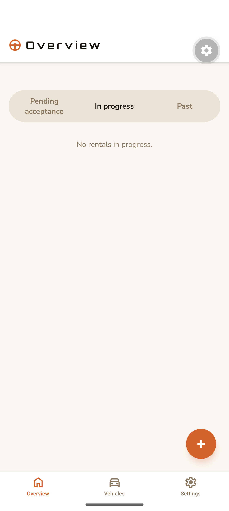
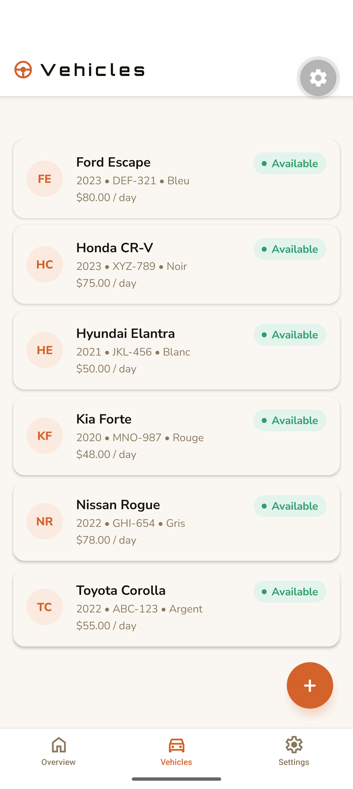
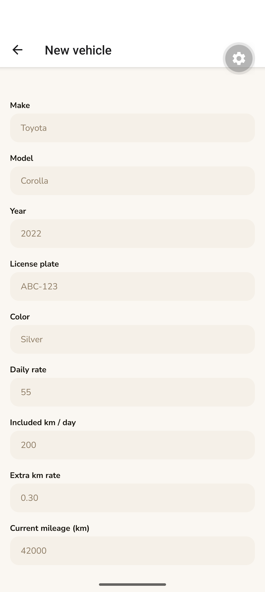
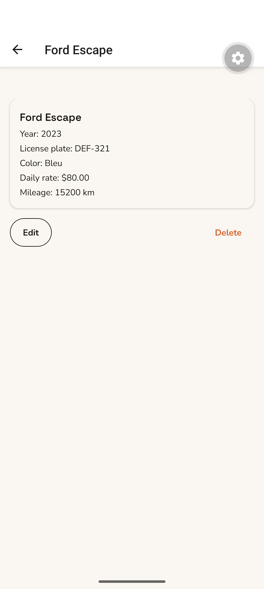
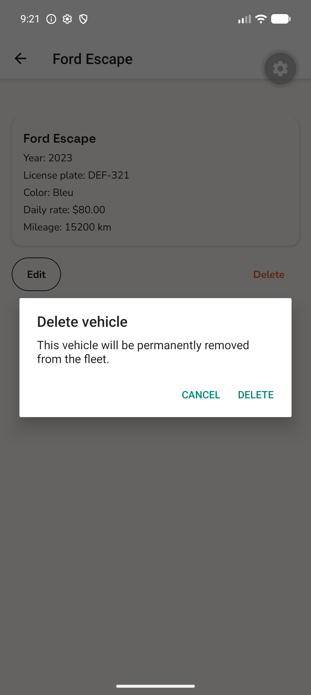
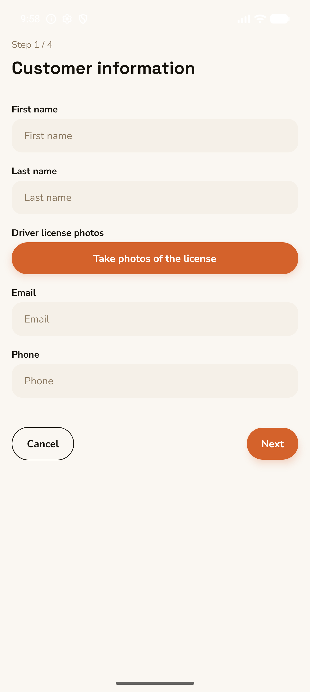
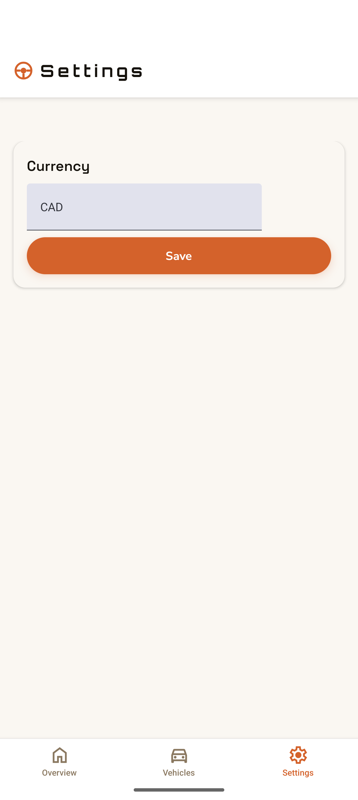

# Car Rental — Quote & Rental Management App

A production-style **React Native (Expo)** app for an independent car-rental
operator, backed by a **vertical-slice Node microservice**. The operator manages
their fleet, builds a rental from customer + vehicle + dates, captures the car's
condition with the camera, generates a branded **Quote PDF**, collects payment
through a **Stripe** link, and closes the rental out at return — all offline-first
on the device, with payments, notifications, and AI vehicle recognition handled
server-side.

> Built as a portfolio piece to demonstrate end-to-end product engineering:
> clean mobile architecture (MVVM + feature-first), a vertical-slice backend with
> a hexagonal/DDD core and an event-driven side-effect bus, typed end-to-end,
> internationalized, and tested.

---

## Demo

🎥 **[Watch the screen-recorded walkthrough](docs/media/demo.mp4)** (~25s: fleet → vehicle detail → rental wizard → settings).

| Overview (rental lifecycle) | Fleet | Add / edit vehicle |
|---|---|---|
|  |  |  |

| Vehicle detail | Safe delete | Rental wizard · step 1 |
|---|---|---|
|  |  |  |

| Settings (configurable currency) |
|---|
|  |

*The full rental wizard (customer → vehicle → inspection → recap → quote → accept
→ return) is implemented end-to-end; see `docs/media/`.*

---

## What it does

**Fleet management (full CRUD).** List the fleet, add / edit / delete vehicles,
each with make, model, year, plate, color, daily rate, included km/day, extra-km
rate and current odometer. When adding a vehicle, the operator can **snap a few
photos and let AI pre-fill the form** — the app sends the photos to the backend,
which asks **Claude vision** to recognize make / model / year / color and returns
a best-effort draft. Deletion is **blocked while a vehicle is on an active
rental** so history stays consistent. Persisted in on-device SQLite.

**Rental lifecycle.** A guided multi-step wizard creates a rental:
1. **Customer** — name, contact, and **driver-license photos** captured with the camera.
2. **Vehicle & dates** — pick from the fleet; pricing previews live.
3. **Inspection** — starting mileage, fuel level, condition notes, before-photos.
4. **Recap** — review, then generate a **Quote PDF** and send it.

The rental then moves through clear states — **Pending acceptance → In progress →
Returned** — derived from the data (`acceptedAt` / `returnedAt`), with quote
acceptance (customer signature) and a **return checkout** that records end mileage
/ fuel / after-photos and produces a return report.

**Payments.** At acceptance, the app asks the backend to create a **Stripe payment
link** for the quote (and, at return, for any **extra-mileage** surcharge). The
app polls the link's status; the backend emails the link to the customer and, on
payment, fans out a company push notification + a customer confirmation email
through a message bus (see below).

**Built for a real operator.** Bilingual **FR / EN**, a configurable **currency**,
vehicle/customer snapshots stored on each rental so a later fleet edit never
rewrites a past quote, and graceful degradation (push works without it, the app
keeps running).

---

## Architecture

A pnpm monorepo with two independently-deployable apps.

```
apps/
  mobile/   Expo app — the operator's tool (this is what the screenshots show)
  server/   Stateless vertical-slice microservice (payments + vehicle recognition)
```

The mobile app only ever talks to the server over HTTP — **no payment-provider or
AI secret ever lives on the device**. Two seams cross the boundary:

| Seam | Mobile client | Server route |
|---|---|---|
| Create + email a payment link | `rental/services/payment` | `POST /payment-links` |
| Poll payment status | `rental/services/payment` | `GET /payment-links/:id/status` |
| Recognize a vehicle from photos | `fleet/services/vehicleRecognition` | `POST /vehicle-recognition` |

### Mobile — MVVM, organized by business feature

Not by technical layer. Each bounded context (`fleet`, `rental`, `home`,
`settings`) owns its `model / view / viewmodel / repository / services / i18n`.

```
features/fleet/
  model/        Vehicle types + Zod validation schema
  view/         Presentational React components (atomic design)
  viewmodel/    Hooks holding all state/logic (TanStack Query + Form)
  repository/   SQLite-backed data access behind an interface (+ in-memory fake)
  services/     Cross-boundary calls to the server (e.g. vehicle recognition)
  i18n/         FR / EN strings
```

- **Views are dumb, ViewModels hold the logic.** Every `useXViewModel` exposes a
  named `UseXViewModelResult` return type. Route files in `app/` only compose a
  View + ViewModel — no logic.
- **Repositories behind interfaces.** Production uses `expo-sqlite`; tests inject
  an in-memory fake — so business logic is unit-tested without a device.
- **Server seam.** The mobile app never holds a Stripe / Resend / Anthropic
  secret; it only calls the backend's HTTP API.

**Stack:** Expo SDK 56 · React Native 0.85 · expo-router (typed routes) ·
TanStack Query + TanStack Form (Zod via Standard Schema, no adapter) · Zustand ·
expo-sqlite · expo-camera · expo-print (HTML→PDF) · expo-sharing ·
expo-notifications · i18next · TypeScript (strict).

### Server — vertical slices, each internally hexagonal (DDD), event-driven

Stateless: **Stripe is the source of truth for payment state, RabbitMQ is the
transport — no database.** One folder per feature; within a slice, dependencies
point inward to a pure `domain/`, and provider SDKs (Stripe, Resend, Expo,
Anthropic) live only at the edges. A slice never imports another slice.

```
features/
  payments/                 Stripe links, status polling, webhook, side-effect bus
    domain/                 Pure VOs/entities (Money owns major→minor units)
    application/
      ports/                PaymentGateway, EmailSender, PushNotifier, EventPublisher
      usecases/             Orchestration only, depends on ports
    infrastructure/         Adapters: stripe / resend / expo / rabbitmq / http
    payments.api.ts         Slice composition (API)
    payments.worker.ts      Slice composition (worker)
  vehicle-recognition/      Claude-vision pre-fill of a vehicle from photos
    domain/ application/ infrastructure/ + vehicle-recognition.api.ts
composition/                API + worker composition roots
```

Two processes share the code: the **API** verifies the Stripe webhook and
*publishes* `payment.completed`; a separate **worker** *consumes* it and runs the
side effects (company push + customer email) with retry + a dead-letter parking
lot — so a provider outage can't silently lose a notification.

**Stack:** Node · Express · TypeScript · `stripe` · `resend` · `amqplib`
(RabbitMQ) · `@anthropic-ai/sdk` (Claude vision) · Docker Compose for a local
broker.

> Deep dives: [`apps/server/docs/architecture.md`](apps/server/docs/architecture.md)
> (vertical slices, dependency rules, adding a feature) and
> [`apps/server/docs/payment-bus.md`](apps/server/docs/payment-bus.md) (the
> RabbitMQ side-effect bus, with a primer and diagrams).

---

## Engineering highlights

- **Clean separation end-to-end** — feature-first MVVM on the client, vertical
  slices with a hexagonal/DDD core on the server; SDKs and frameworks kept at the
  edges, business rules in the middle.
- **Offline-first** — the whole operator workflow runs on-device against SQLite;
  the network is only touched for payments and AI vehicle recognition.
- **Event-driven backend** — at-least-once delivery, dead-letter parking lot, and
  a fast webhook ACK so Stripe never blocks on email/push.
- **AI where it helps** — Claude vision pre-fills a new vehicle from photos, behind
  a port so the app stays testable and the provider stays swappable.
- **Typed & validated** — TypeScript strict on both apps; Zod schemas drive form
  validation through TanStack Form's Standard-Schema support.
- **Tested** — unit tests for schemas, viewmodels, repositories and the rental
  lifecycle via injected in-memory fakes; E2E specs for the quote flow.
- **Internationalized & themable** — FR/EN throughout, configurable currency.

---

## Running it locally

Prerequisites: Node 20+, pnpm, and the Expo toolchain (Android Studio / Xcode for
a device, or Expo Go). `pnpm install` at the root installs both apps.

```bash
pnpm install

# Mobile app
pnpm --filter mobile run android      # or: run ios / run start
pnpm --filter mobile exec tsc --noEmit # typecheck
pnpm --filter mobile test              # unit + E2E tests

# Backend (optional — only needed for payments + vehicle recognition)
docker compose -f apps/server/docker-compose.yml up -d   # local RabbitMQ
pnpm --filter server run dev                              # API (hot reload)
pnpm --filter server run worker                           # side-effect worker
```

The mobile app seeds a starter fleet on first launch, so you can explore the
fleet and rental flows immediately without the backend running.

---

## Project layout

```
.
├── apps/
│   ├── mobile/    Expo app — features/{fleet,rental,home,settings}, shared/{ui,persistence,i18n}
│   └── server/    Vertical-slice microservice — features/{payments,vehicle-recognition}, composition/
├── docs/media/    Screenshots + demo video used above
└── pnpm-workspace.yaml
```

See [`apps/mobile/CLAUDE.md`](apps/mobile/CLAUDE.md) and
[`apps/server/CLAUDE.md`](apps/server/CLAUDE.md) for per-app architecture,
conventions, and gotchas.
