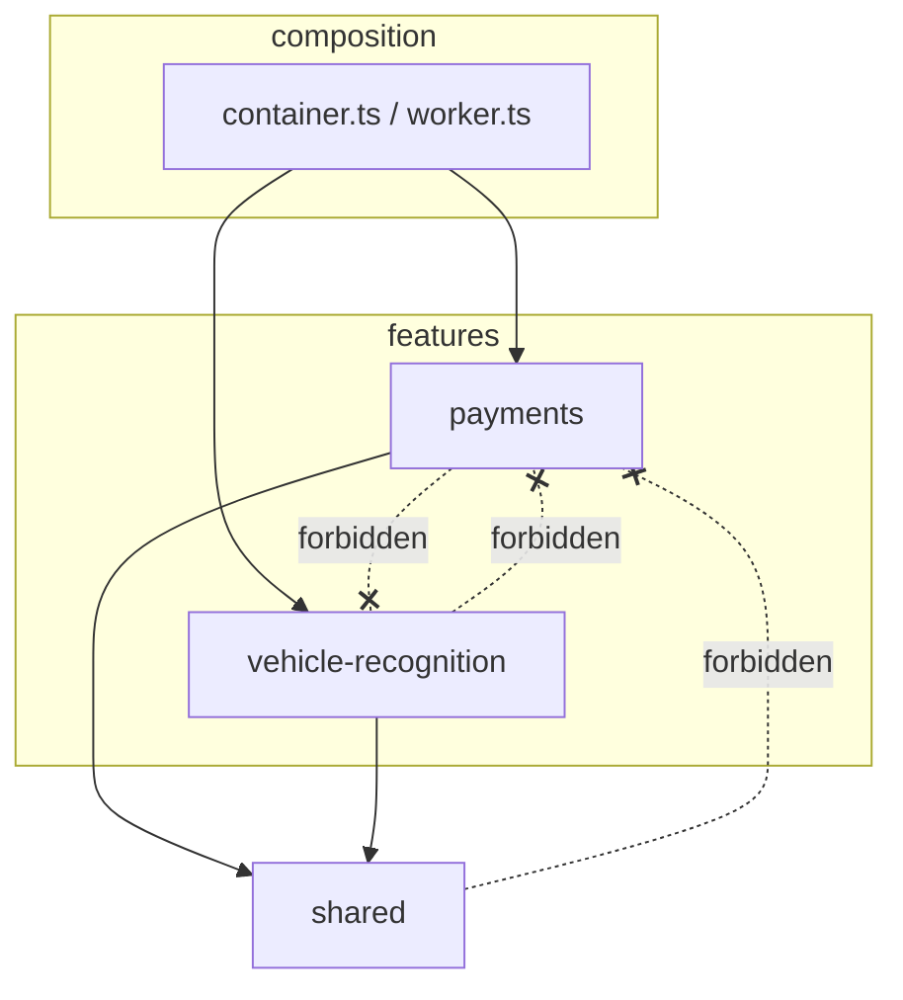

# Architecture — vertical slices (hexagonal per slice)

How this server is organized, why, and how to extend it without breaking the
rules.

## TL;DR

- Code is grouped **by feature** (a *slice*), not by technical layer.
- Each slice is **internally hexagonal**: `domain` → `application` (ports +
  use cases) → `infrastructure` (adapters).
- A slice **never imports another slice**. Anything genuinely shared lives in
  `shared/` — which never imports a slice.
- The composition roots (`composition/`) wire slices together; they are the
  only place that knows more than one slice.

## Why vertical slices?

The classic layered ("horizontal") layout groups all controllers together, all
services together, all models together. To change one feature you touch every
layer folder, and unrelated features sit in the same files — they drift into
coupling.

A **vertical slice** is a full column through every layer for *one* feature.
Everything a feature needs is in one folder, so:

- **High cohesion, low coupling** — a feature's code is together; features don't
  reach into each other.
- **Easy to add/remove a feature** — drop in (or delete) one folder.
- **Easy to navigate (humans and AI)** — "where's the vehicle-recognition
  code?" → `features/vehicle-recognition/`, all of it.

### Analogy

Think of a layered cake sliced two ways:

```
Horizontal layers (old)            Vertical slices (now)
+---------------------------+      +-----------+-----------------+
| controllers (all features)|      | payments  | vehicle-recog.  |
+---------------------------+      |  http     |  http           |
| services    (all features)|      |  usecases |  usecases       |
+---------------------------+      |  domain   |  domain         |
| models      (all features)|      |  adapters |  adapters       |
+---------------------------+      +-----------+-----------------+
  cut by TECHNICAL ROLE               cut by FEATURE (full stack each)
```

You eat a *slice* of cake (one feature, top to bottom), not a single horizontal
layer.

## Layout

```
src/
  shared/                  Cross-cutting kernel. No feature logic. Imports no slice.
    config/env.ts          Typed environment loading.
    http/app.ts            Express app factory (createApp) + static/health pages.
    messaging/             Generic RabbitMqConnection (knows no topology).
  features/
    payments/              Stripe links, status polling, webhook, side-effect bus.
      domain/              Pure value objects / entities (no SDK imports).
      application/
        ports/             Interfaces the slice needs (PaymentGateway, …).
        usecases/          Orchestration; depends only on ports.
      infrastructure/      Adapters implementing the ports + HTTP edge
                           (stripe/ resend/ expo/ rabbitmq/ http/).
      payments.api.ts      Slice composition for the API process.
      payments.worker.ts   Slice composition for the worker process.
    vehicle-recognition/   Claude-vision pre-fill of a vehicle from photos.
      domain/  application/  infrastructure/  vehicle-recognition.api.ts
  composition/
    container.ts           API root: builds each slice, assembles the app.
    worker.ts              Worker root: starts each slice's consumers.
  index.ts                 API entry point.
  worker.ts                Worker entry point.
```

## Dependency rules

Arrows = "is allowed to import". Anything not drawn is forbidden.



Inside a slice, the same inward rule as hexagonal:

```
infrastructure  ->  application  ->  domain
   (adapters)        (use cases)     (pure, imports nothing)
```

`domain` imports nothing. `application` imports only its own `domain` + `ports`.
`infrastructure` implements the ports. The HTTP controller and the provider SDK
both sit in `infrastructure` — business rules never live there.

## How to add a new feature

1. Create `features/<feature>/` with `domain/`, `application/{ports,usecases}/`,
   `infrastructure/`.
2. Model the feature in `domain/` (pure types), define the **ports** it needs in
   `application/ports/`, write the **use cases** in `application/usecases/`.
3. Implement each port with an adapter under `infrastructure/` (one folder per
   provider), and add the HTTP controller under `infrastructure/http/`.
4. Add a composition module `<feature>.api.ts` (and `<feature>.worker.ts` if it
   consumes events) that wires adapters → use cases → routers.
5. Call it from `composition/container.ts` (and `composition/worker.ts`), and
   mount its router(s) via `shared/http/app.ts`.

## How to add an outbound dependency to a slice

Define a **port** in that slice's `application/ports/`, implement it under the
slice's `infrastructure/`, and wire it in the slice's composition module. The
provider SDK and its secret stay inside that adapter.

## What belongs in `shared/`?

Only genuinely cross-cutting plumbing with **no feature knowledge**: env
loading, the Express app factory, the generic RabbitMQ connection. If you're
tempted to put feature logic in `shared/`, it belongs in a slice. `shared/`
must never import from `features/`.

## See also

- [`docs/payment-bus.md`](payment-bus.md) — the payments slice's RabbitMQ
  side-effect bus (workflow diagrams + a RabbitMQ primer).
- [`src/features/payments/domain/CONTEXT.md`](../src/features/payments/domain/CONTEXT.md)
  — the payments bounded context (ubiquitous language, invariants).
