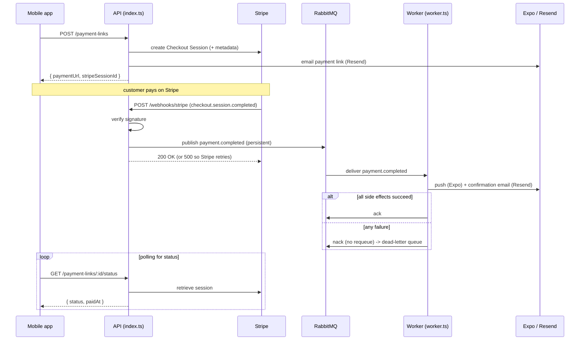
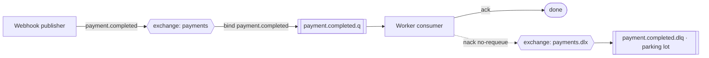

# Payment side-effect bus (RabbitMQ)

How a completed Stripe payment fans out to its side effects (company push +
customer confirmation email) through RabbitMQ, and why it's built this way.

## Why a message bus?

Before, the Stripe webhook ran the side effects **inline and synchronously**,
and swallowed any error — so a transient Expo/Resend outage meant a **lost**
notification, with no retry.

Now the webhook only **publishes** an event and ACKs Stripe immediately. A
separate **worker** consumes the event and runs the side effects with
**retries** and a **dead-letter queue** — nothing is lost silently.

RabbitMQ is a **transport**, not a datastore: Stripe stays the single source of
truth for payment state, and no business data is persisted on this server.

## RabbitMQ in 2 minutes — the restaurant analogy 🍽️

| RabbitMQ concept | In a restaurant | In this app |
|---|---|---|
| **Publisher** | the waiter clips the ticket to the rail and leaves | the **Stripe webhook** |
| **Exchange** | the pass that sorts tickets to the right station | routes `payment.completed` |
| **Routing key** | the ticket's label | `payment.completed` |
| **Binding** | rule "this label goes to this station" | exchange → queue binding |
| **Queue** | a station's ticket rail (a buffer) | `payment.completed.q` |
| **Consumer** | the cook working the tickets | the **worker** |
| **ack / nack** | "done, unclip it" / "can't make it" | success / failure |
| **Dead-letter (DLQ)** | the "problem tickets" board the chef reviews | `payment.completed.dlq` |
| **persistent / durable** | tickets are written down, survive a power cut | survive a broker restart |
| **prefetch** | a cook only holds N tickets at once | consumer QoS |

**The key idea:** the waiter (webhook) does not cook. It drops the ticket and
**replies to Stripe right away**. The cooks (workers) cook at their own pace,
retry on failure, and set aside what fails for good — instead of losing it.

## Workflow

### High-level flow (ASCII)

```
  Mobile app                 API (index.ts)              Stripe
     |  POST /payment-links       |                         |
     |--------------------------->| create session + email  |
     |   { paymentUrl }           |------------------------>|
     |<---------------------------|                         |
     |                            |                         |
     |        ... customer pays on Stripe ...               |
     |                            |   POST /webhooks/stripe  |
     |                            |<------------------------ |
     |                            | verify sig + publish     |
     |                            |        |  200 (or 500 -> Stripe retries)
     |                            v        |
     |                      [ RabbitMQ: payments exchange ]
     |                            |  payment.completed.q
     |                            v
     |                       Worker (worker.ts)
     |                       /            \
     |                 push (Expo)   confirmation email (Resend)
     |                    success -> ack  |  failure -> nack -> DLQ
     |                            |
     |  GET /payment-links/:id/status (polling, unchanged)
     |--------------------------->| retrieve from Stripe
     |<---------------------------|
```

### Sequence diagram (Mermaid)



### Bus topology (Mermaid)



## Topology details

Declared idempotently by both processes in
`src/features/payments/infrastructure/rabbitmq/topology.ts`:

| Object | Name | Type | Notes |
|---|---|---|---|
| Exchange | `payments` | topic | the API publishes here |
| Queue | `payment.completed.q` | durable | consumed by the worker; dead-letters to `payments.dlx` |
| Exchange | `payments.dlx` | fanout | dead-letter exchange |
| Queue | `payment.completed.dlq` | durable | parking lot for failed messages |

Routing key: `payment.completed`.

## Behavior & guarantees

- **Fast ACK:** the webhook only publishes, then replies. If publishing fails it
  returns **500** so Stripe redelivers — with no DB, Stripe's retry is the
  safety net.
- **Reliable side effects:** the worker handler propagates errors; on failure
  the message is `nack`-ed without requeue and lands in the DLQ for
  inspection / replay.
- **At-least-once delivery:** a retry may re-run a side effect that already
  succeeded (e.g. a duplicate push). Keep side effects tolerant of that.
- **Stateless:** every field the worker needs (`rentalId`, `customerEmail`,
  `customerName`, `amount`, `currency`, push fields) travels in the Stripe
  session metadata. No server-side storage.

## Run it locally

```bash
# 1. Start the broker (management UI at http://localhost:15672, guest/guest)
docker compose -f apps/server/docker-compose.yml up -d

# 2. Start the API (publishes) and the worker (consumes) in two terminals
pnpm --filter server run dev
pnpm --filter server run worker
```

Trigger a payment event with the Stripe CLI:

```bash
stripe listen --forward-to localhost:4000/webhooks/stripe
stripe trigger checkout.session.completed
```

Watch the message flow (and the DLQ when a handler fails) in the management UI
under **Queues**.
